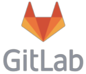

## *Portfolio*

I am a Versatile DevOps Engineer with 3 years experience. Seeking to leverage proven continuous integration and deployment skills to raise quality. Implemented automated deployments, saved manual efforts and resulting in 99% reduction in wait time, speedier deployments and increased customer satisfaction. Involved in CI-CD implementation, administration of DevOps tools and analysis of new business opportunities.

---

## *Skills*

<!-- 
logo symbol - https://simpleicons.org/ 
color code - https://htmlcolorcodes.com/color-names/
-->

<!--

  
  
  
  
  
  
  
  
  
  

-->

---

## *Experience*

* ### **Associate Consultant - DevOps**
  ### Infosys, Chennai. (Oct 2021 - Present)
  
Working with meetings and workshops team to provide best experience to faciltators and participants while running meetings . I worked on features like creating isolated environment for participants during meeting, providing them limited tools to collaborate and created navigation panel for facilitators to move participants to different slides

* ### **Junior DevOps Engineer**
  ### Cognizant, Chennai. (June 2019 - Sep 2021)
  
Working with meetings and workshops team to provide best experience to faciltators and participants while running meetings . I worked on features like creating isolated environment for participants during meeting, providing them limited tools to collaborate and created navigation panel for facilitators to move participants to different slides.

---

## *Education*

* ### **Anna University (Distance Education)**
  ### MBA, Operations Management (2020- 2022)
  Percentage **60%**  
* ### **St. Joseph’s Institute of Technology**
  ### B.E Computer Science and Engineering (2015- 2019)
  Percentage **71%**
* ### **New Prince Mat. Hr. Sec. School**
  ### HSC (2015)
  Percentage **87.6%**
* ### **New Prince Mat. Hr. Sec. School**
  ### SSLC (2013)
  Percentage **92%**

---

## *Interest*
Apart from being a web developer, I do content creation. I make videos related to frontend and general tech.

I enjoy being outdoors, so i go for run everyday. I love travelling to different countries and explore different cultures. When i am inside , i play guitar and sing in my free time.

---
